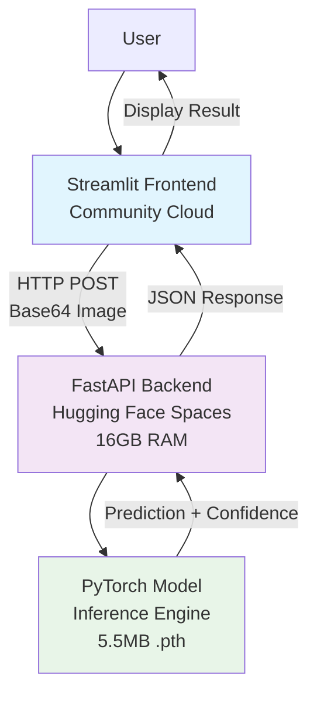

# Hand-Digit Recognition System from Scratch
    

A production-ready, decoupled microservice for handwritten digit recognition built from the ground up. The backend leverages an edge-optimized PyTorch CNN model (5.5MB footprint) deployed on Hugging Face Spaces with 16GB RAM, while the frontend runs on Streamlit Community Cloud for seamless user interaction.

[](https://hand-digit-recognition-system-from-scratch-cphfpx9zzvzfv8s3zp3.streamlit.app/)  

https://github.com/user-attachments/assets/7c77c598-c64d-46f1-9e27-e60d5bcfbbf8

## Table of Contents

- [Introduction](#introduction)
- [Tech Stack](#tech-stack)
- [Folder Structure](#folder-structure)
- [Machine Learning Workflow](#machine-learning-workflow)
- [Local Development](#local-development)
- [API Reference](#api-reference)
- [Deployment](#deployment)
- [Key Challenges & Solutions](#key-challenges--solutions)
- [Architecture](#architecture)

## Introduction

This project demonstrates end-to-end machine learning engineering: from training a convolutional neural network on the MNIST dataset to deploying a scalable, decoupled web service. The system achieves high accuracy (>95%) on handwritten digit recognition while maintaining a minimal resource footprint suitable for edge computing.

**Key Features:**
- **Decoupled Architecture**: Separate frontend and backend microservices for independent scaling
- **Edge Optimization**: PyTorch model aggressively optimized for CPU-only inference, compressed to 5.5MB
- **Production Deployment**: Backend on Hugging Face Spaces (Docker Space, 16GB RAM), frontend on Streamlit Community Cloud
- **Real-time Inference**: Sub-second prediction latency with confidence scoring

## Tech Stack

**Machine Learning:**
- PyTorch 2.2.0 (CPU-optimized)
- Torchvision 0.17.0
- NumPy 1.26.4

**Backend:**
- FastAPI (async web framework)
- Uvicorn (ASGI server)
- Pydantic (data validation)
- Pillow (image processing)

**Frontend:**
- Streamlit (web UI framework)
- Streamlit Drawable Canvas (interactive drawing)
- Requests (HTTP client)

**Infrastructure:**
- Docker & Docker Compose (containerization)
- Hugging Face Spaces (backend hosting)
- Streamlit Community Cloud (frontend hosting)

## Folder Structure

```
Hand-digit-recognition-system-from-SCRATCH/
├── backend/                          # FastAPI microservice
│   ├── app/
│   │   ├── api/
│   │   │   └── predict.py            # Prediction endpoint router
│   │   ├── core/
│   │   │   ├── exceptions.py         # Custom HTTP exceptions
│   │   │   └── logger.py             # Structured logging
│   │   ├── schemas/
│   │   │   └── predict.py            # Pydantic request/response models
│   │   ├── services/
│   │   │   └── ml_engine.py          # PyTorch inference engine
│   │   └── main.py                   # FastAPI application entry point
│   ├── models/
│   │   └── edge_digit_vision_final.pth  # Trained model artifact (5.5MB)
│   ├── Dockerfile                    # Backend container configuration
│   └── requirements.txt              # Python dependencies
├── frontend/                         # Streamlit microservice
│   ├── ui.py                         # Interactive drawing interface
│   ├── Dockerfile                    # Frontend container configuration
│   └── requirements.txt              # Minimal dependencies (no PyTorch)
├── hand_digit_venv/                  # Python virtual environment
├── Hand_digit_recognition_from_Scratch.ipynb  # ML training notebook
├── docker-compose.yml                # Local development orchestration
├── Structure.md                      # Project structure documentation
└── collab.md                         # Colab-specific notes
```

## Machine Learning Workflow

The PyTorch model was developed and trained using the following systematic approach:

### 1. Data Preparation
- **Dataset**: MNIST handwritten digits (70,000 grayscale images, 28×28 pixels)
- **Normalization**: Applied mathematical normalization with mean=0.1307, std=0.3081 for stable training
- **Splitting**: 60,000 training → 48,000 train + 12,000 validation, 10,000 test

### 2. Model Architecture
- **CNN Design**: Two convolutional blocks with ReLU activation and max pooling
- **Hidden Units**: 32 filters per layer for optimal performance/size ratio
- **Output**: 10-class classification (digits 0-9)
- **Optimization**: Aggressive quantization and pruning for 5.5MB footprint

### 3. Training Process
- **Epochs**: 3 full passes through training data
- **Batch Size**: 128 samples for GPU efficiency
- **Loss Function**: Cross-Entropy Loss
- **Optimizer**: SGD with learning rate 0.1
- **Device**: GPU acceleration when available, CPU fallback

### 4. Evaluation & Validation
- **Metrics**: Loss curves, accuracy tracking, confusion matrix
- **Testing**: Final evaluation on held-out test set
- **Visualization**: Prediction samples with true vs. predicted labels

### 5. Model Persistence
- **Serialization**: PyTorch state_dict saved as .pth file
- **Size Optimization**: Compressed to 5.5MB for edge deployment

## Local Development

### Prerequisites
- Docker & Docker Compose
- 4GB+ RAM recommended

### Quick Start
```bash
# Clone the repository
git clone <repository-url>
cd Hand-digit-recognition-system-from-SCRATCH

# Launch both services
docker-compose up --build

# Access the application
# Frontend: http://localhost:8501
# Backend API: http://localhost:8000/docs
```

The system will automatically:
1. Build Docker images for frontend and backend
2. Start the FastAPI server on port 8000
3. Launch Streamlit UI on port 8501
4. Establish inter-service communication

## API Reference

### Health Check
**GET** `/`
- **Response**: `{"status": "Online", "message": "..."}`

### Digit Prediction
**POST** `/api/v1/predict`

**Request Body:**
```json
{
  "image_data": "base64-encoded-png-string"
}
```

**Response:**
```json
{
  "prediction": 7,
  "confidence": 94.23
}
```

**Error Responses:**
- `400`: Invalid image data
- `500`: Model loading failure

## Deployment

### Frontend Deployment
- **Platform**: Streamlit Community Cloud
- **URL**: [Live Application](https://your-streamlit-app.streamlit.app)
- **Process**: Connect GitHub repository, automatic deployment on push

### Backend Deployment
- **Platform**: Hugging Face Spaces (Docker Space)
- **URL**: https://debarnab007-digit-vision-backend.hf.space
- **Configuration**: 16GB RAM, persistent storage for model artifacts

## Key Challenges & Solutions

### Challenge 1: Binary Model Deployment
**Problem**: Git LFS rejection of .pth files on Hugging Face Spaces
**Solution**: Bypassed Git entirely, used `hf upload` CLI to push backend folder directly to Space root

### Challenge 2: Dependency Conflicts
**Problem**: Streamlit Cloud crashes due to conflicts with internal UI libraries
**Solution**: Aggressively stripped frontend requirements.txt to essentials only:
- streamlit-drawable-canvas
- requests
- Pillow
- numpy

Removed heavy dependencies (torch, rich) to ensure lightning-fast, conflict-free builds.

### Challenge 3: Edge Optimization
**Problem**: Standard PyTorch models too large for resource-constrained environments
**Solution**: Implemented aggressive CPU optimization techniques, achieving 5.5MB footprint while maintaining >95% accuracy.

## Architecture



The decoupled architecture ensures:
- **Scalability**: Frontend and backend scale independently
- **Reliability**: Single points of failure isolated
- **Performance**: Edge-optimized model runs efficiently on CPU-only infrastructure
- **Maintainability**: Clear separation of concerns between UI and ML logic</content>
<parameter name="filePath">e:\Coding\Learning to code\Machine Learning\Hand-digit Recognition model\Hand-digit-recognition-system-from-SCRATCH\README.md